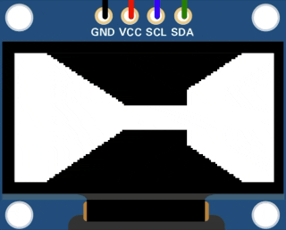

# esp32-raycaster

A tiny raycasting engine inspired by [cub3d](https://github.com/jeromeberg/cub3d) and rewritten in C++ for ESP32 and a 128x64 monochrome OLED.




## Hardware

- NodeMCU-32S
- SSD1306 128x64 I2C OLED
- 3 buttons

| Component      | Pin     |
|----------------|---------|
| OLED SDA       | GPIO 21 |
| OLED SCL       | GPIO 22 |
| Forward button | GPIO 25 |
| Left button    | GPIO 32 |
| Right button   | GPIO 33 |

## Instructions

### Build

```sh
pio run -e nodemcu-32s
```

### Upload

```sh
pio run -e nodemcu-32s -t upload
```

### Tests

```sh
pio test -e native
```